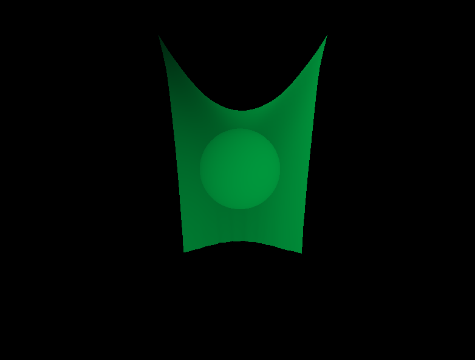
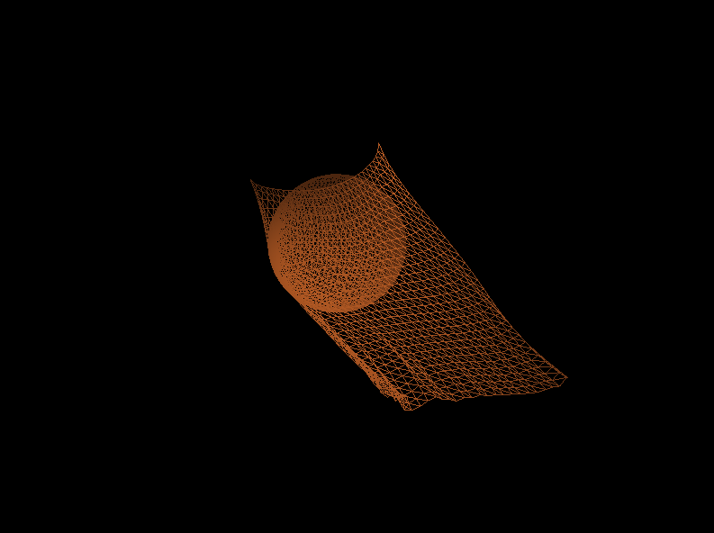

# Cloth simulation

Cloth simulation with mass spring method and constraint based method in C++ and OpenGL.



### Features

  - Simulating method can be choosen from [**mass spring**](http://creativecoding.evl.uic.edu/courses/cs488/finalprojects/cloth/cloth.pdf) and [**constraint based**](http://www.cs.cmu.edu/~ytoh/stickyfingers.pdf)
  - Object collision
  - Wind
  - Stiffness increase / decrease
  - Tearable
  - View / Shading mode options

### How to use
In terminal, under current folder
```sh
$ make
$ ./main -r 30 -c 30 -m 0 -p 0
```
To run with different parameters
| Opt | Meaning | Value |
| ------ | ------ | ------ |
| -r  | grid row count | [3, 30] |
| -c | grid column count | [3, 30] |
| -m | mode | 0 ( mass spring ), 1 ( constraint based ) |
| -p | pin 2 or 4 points | 0(2), 1(4) |

In the window, to change the view or interact with the cloth
| Key | Meaning  |
| ------ | ------ |
| W/A/S/D  | Move the view |
| mouse scrolling | Scale the view |
| R | Reset to default view |
| T | Change to side view |
| E (hold) + mouse | Rotate the view |
| Z | Turn on/off the wind|
| X/C | Increase/Decrease spring stiffness |
| Y | Toggle wireframe/shaded mode |
| I/J/K/L/U/O | Move the ball |
| [ | Decrease the ball radius |
| ] | Increase the ball radius |

